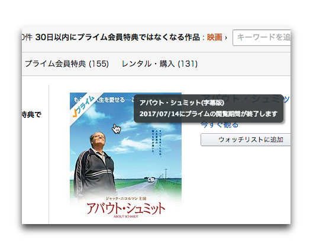
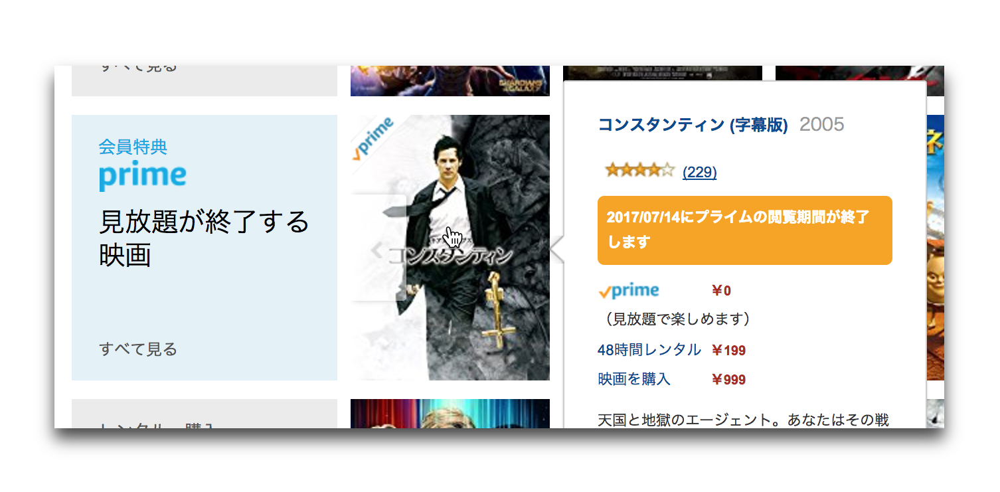

# Amazon ビデオの見放題終了日を表示するブラウザ拡張

## これは何か

Amazon ビデオ → 映画 → 見放題が終了する映画 → すべて見る
で表示されるリスト（30 日以内にプライム会員特典ではなくなる作品）でタイトル画像にマウスオーバーすると見放題終了日（プライムの閲覧期間終了日）を確認することができます。
Chrome と Safari で動作します。

## なぜこんなものを作ったのか

Amazon ビデオ（Amazon Prime Video）では、30 日以内に見放題が終了する映画をリストアップすることができます。
次にどれを見るか決めるのが面倒なときはこのリストに上がってくる作品を適当に選んで見ていることが多いです。

実際に何日まで見放題なのかは "映画" のトップページで下の方にスクロールして「見放題が終了する映画」という行のタイトル画像にマウスカーソルを重ねたときに表示されるツールチップで確認することができます（リストに追加されたばかりのタイトルでは表示されない場合もあります）。

この行内に表示されるのは一部のタイトルのみで、全タイトルを確認するには "すべて見る" リンクをクリックする必要があるのですが、なぜか遷移先の画面ではツールチップが表示されず終了日を確認することができません。
これが不便だったので拡張を作ることにしました。

## インストール

### Chrome

1. [Releases](https://github.com/harawata/prime-video-expiration-date/releases/) から最新の .zip アーカイブをダウンロードして解凍します。
2. chrome://extensions を開いて "パッケージ化されていない拡張機能を読み込む..." ボタンを押します。
3. ディレクトリ選択ダイアログで `PrimeVideoExpirationDate.safariextension` ディレクトリを選択します。

### Safari

1. [Releases](https://github.com/harawata/prime-video-expiration-date/releases/) から最新の .zip アーカイブをダウンロードして解凍します。
2. Safari の開発メニューから "機能拡張ビルダー" を選びます。
3. 左下の "+" ボタンを押して "機能拡張を追加…" を選びます。
4. `PrimeVideoExpirationDate.safariextension` ディレクトリを選択します。
5. "インストール" ボタンを押してインストールします。
6. 証明書がない場合は Safari を再起動するたびにインストールする必要があるようです。

## ライセンス

MIT License
